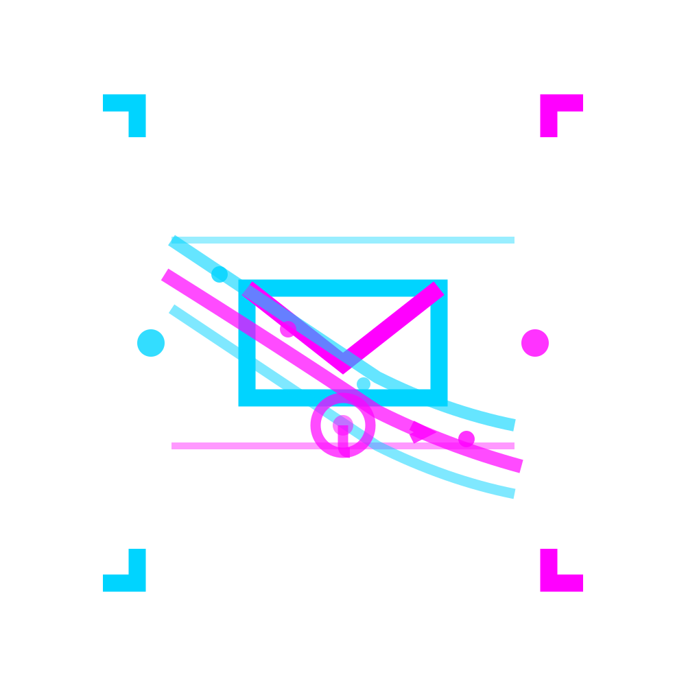

# cdk8s-mailu

<table>
<tr>
<td>
<blockquote>
CDK8S construct library for deploying Mailu mail server to Kubernetes
</blockquote>
</td>
<td align="right">

</td>
</tr>
</table>

[](LICENSE)

📚 **[Full Documentation](documentation/)** | [Quick Start](#quick-start) | [Architecture](documentation/sources/explanation/architecture.md)

## Overview

`cdk8s-mailu` is a [CDK8S](https://cdk8s.io/) construct library that provides a **type-safe, production-grade** way to deploy [Mailu](https://mailu.io/) mail server to Kubernetes. Generate complete Kubernetes manifests from TypeScript code with compile-time validation and IDE autocomplete.

## Why cdk8s-mailu?

- **Type-Safe Configuration** - Catch errors at compile time, not deploy time
- **Production-Grade Defaults** - Resource limits and storage sizes based on real deployments
- **Modular Architecture** - Enable/disable components with simple flags
- **Dedicated Dovecot Submission Service** - Solves webmail email sending with clean architecture
- **Well-Documented** - Comprehensive documentation following Diátaxis framework
- **Battle-Tested** - Production deployment at kup6s.com with AMD64/ARM64 mixed nodes

**[See Complete Architecture →](documentation/sources/explanation/architecture.md)**

## Installation

```bash
npm install cdk8s-mailu
# or
yarn add cdk8s-mailu
```

**Prerequisites**: Kubernetes 1.28+, PostgreSQL, Redis, Node.js 18+

**[Full Prerequisites →](documentation/sources/tutorials/01-quick-start.md#prerequisites)**

## Quick Start

Create `mailu.ts`:

```typescript
import { App } from 'cdk8s';
import { MailuChart } from 'cdk8s-mailu';

const app = new App();

new MailuChart(app, 'mailu', {
  namespace: 'mailu',
  domain: 'example.com',
  hostnames: ['mail.example.com'],
  subnet: '10.42.0.0/16',  // Your Kubernetes pod CIDR
  timezone: 'UTC',

  database: {
    type: 'postgresql',
    postgresql: {
      host: 'postgres-rw',
      port: 5432,
      database: 'mailu',
      secretName: 'postgres-app',
      secretKeys: {
        username: 'username',
        password: 'password',
      },
    },
  },

  redis: {
    host: 'redis',
    port: 6379,
  },

  secrets: {
    mailuSecretKey: 'mailu-secrets',
    initialAdminPassword: 'mailu-secrets',
  },

  components: {
    webmail: true,   // Roundcube webmail
    clamav: false,   // Antivirus (requires ~1GB RAM)
  },

  storage: {
    storageClass: 'longhorn',
    dovecot: { size: '50Gi' },  // Mailbox storage
  },
});

app.synth();
```

Generate and deploy:

```bash
npx ts-node mailu.ts
kubectl apply -f dist/mailu.k8s.yaml
```

**[Complete Tutorial with Secrets & DNS →](documentation/sources/tutorials/01-quick-start.md)**

## Documentation

Comprehensive documentation following the [Diátaxis](https://diataxis.fr/) framework:

### **[📘 Tutorials](documentation/sources/tutorials/)** - Learn by doing
- [Quick Start: Deploy Your First Instance](documentation/sources/tutorials/01-quick-start.md)

### **[🔧 How-To Guides](documentation/sources/how-to/)** - Practical solutions
- Configure components
- Customize resources
- Set up TLS termination

### **[💡 Explanation](documentation/sources/explanation/)** - Understanding the design
- [Architecture Overview](documentation/sources/explanation/architecture.md) - Component relationships and CDK8S patterns
- [Dovecot Submission Service](documentation/sources/explanation/dovecot-submission.md) - How webmail email sending works
- [CDK8S Patterns](documentation/sources/explanation/cdk8s-patterns.md) - Construct design patterns

### **[📚 Reference](documentation/sources/reference/)** - Technical specifications
- Configuration API reference
- Component options
- Resource defaults

## Development

```bash
npm run build      # Compile + test + synth
npm run test       # Run tests (>96% coverage)
npm run synth      # Generate manifests only
```

## Contributing

Contributions are welcome! Please see [CONTRIBUTING.md](CONTRIBUTING.md) for guidelines.

## License

Apache License 2.0 - see [LICENSE](LICENSE) file for details.

## Acknowledgments

- [Mailu](https://mailu.io/) - The mail server software
- [CDK8S](https://cdk8s.io/) - Cloud Development Kit for Kubernetes

---

**[📚 Full Documentation](documentation/) | [🚀 Quick Start](documentation/sources/tutorials/01-quick-start.md) | [🏗️ Architecture](documentation/sources/explanation/architecture.md)**
