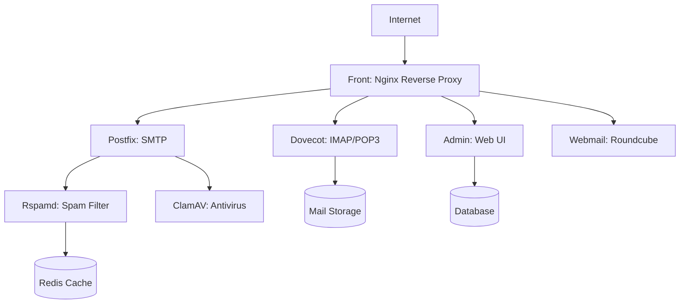

# Architecture Overview

**Understanding the design and structure of cdk8s-mailu deployments.**

## Introduction

cdk8s-mailu is designed around the principle of **composable constructs** - small, reusable building blocks that can be combined to create complex deployments. This architecture provides flexibility while maintaining production-grade defaults.

## Component Architecture

Mailu is a modular mail server composed of multiple services working together:



### Core Components

**Front (Nginx)**
- TLS termination (or Traefik passthrough)
- Protocol routing (SMTP, IMAP, POP3, HTTP/S)
- Load balancing to backend services
- Always required

**Admin**
- Web-based administration interface
- User and domain management
- Configuration interface
- Always enabled by default

**Postfix**
- SMTP server for sending/receiving mail
- Mail routing and relay
- Spam/virus scanning integration
- Always required

**Dovecot**
- IMAP and POP3 server
- Mail storage and retrieval
- Authentication backend
- Always required

**Rspamd**
- Spam filtering
- DKIM signing/verification
- Header manipulation
- Always required

### Optional Components

**Webmail (Roundcube)**
- Browser-based email client
- Contact and calendar management
- Plugin system
- Enabled by default, can be disabled

**ClamAV**
- Antivirus scanning for attachments
- Virus definition updates
- Resource-intensive (requires ~1GB RAM)
- Disabled by default

**Webdav (Radicale)**
- CalDAV and CardDAV server
- Calendar and contact synchronization
- Disabled by default

**Fetchmail**
- Fetch email from external POP3/IMAP servers
- Consolidate multiple accounts
- Disabled by default

## CDK8S Design Patterns

### Construct Hierarchy

```
MailuChart (extends Chart)
  ├── Namespace
  ├── SharedConfigMap
  ├── FrontConstruct
  │   ├── Deployment
  │   ├── Service
  │   └── ConfigMap
  ├── AdminConstruct
  │   ├── Deployment
  │   └── Service
  ├── PostfixConstruct
  ├── DovecotConstruct
  ├── RspamdConstruct
  └── ... (optional components)
```

Each construct is **self-contained** and manages:
- Kubernetes resources (Deployment, Service, ConfigMap, etc.)
- Resource requirements (CPU, memory)
- Volume mounts and storage
- Environment variables
- Service discovery configuration

### Configuration Flow

1. **User provides MailuConfig** - Type-safe configuration object
2. **MailuChart validates config** - Ensures required fields present
3. **Shared resources created** - Namespace, shared ConfigMap
4. **Constructs instantiated conditionally** - Based on component toggles
5. **Resources synthesized** - CDK8S generates Kubernetes YAML

### Resource Management Philosophy

**Defaults optimized for production:**
- Conservative resource requests (pods scheduled reliably)
- Higher limits (allow bursting for traffic spikes)
- Based on real-world usage patterns
- Can be overridden per-component

**Example:** Admin component
- Request: 100m CPU, 256Mi memory (guaranteed minimum)
- Limit: 300m CPU, 512Mi memory (burstable maximum)

## Storage Architecture

### Persistent Volumes

**Data Volume** (`/data`)
- Application data, SQLite database (if used)
- Configuration files
- Default: 10Gi

**Mail Volume** (`/mail`)
- User mailboxes and messages
- Largest storage requirement
- Default: 50Gi, adjust based on users

### Database Options

**SQLite (Default)**
- Simple, zero-configuration
- Suitable for small deployments (<100 users)
- Stored in `/data` volume

**PostgreSQL (Recommended for Production)**
- Better performance and reliability
- Required for high-availability setups
- Managed separately (CNPG, cloud database, etc.)

## Network Architecture

### Service Discovery

All components communicate via Kubernetes services:
- `{component-name}-service` - Standard naming pattern
- Internal DNS resolution
- No external dependencies for inter-component communication

### Ingress/TLS Options

**Option 1: Traefik TLS Termination (Recommended)**
- Traefik handles TLS for SMTP/IMAP protocols
- Nginx wrapper patches Front component
- Automatic certificate management

**Option 2: Front Direct TLS**
- Front handles TLS directly
- Manual certificate management required
- LoadBalancer or NodePort service

## Design Decisions

### Why CDK8S?

*[Content placeholder for docwriter]*

Advantages:
- Type-safe configuration
- IDE autocomplete and validation
- Programmatic manifest generation
- Testable infrastructure code
- Reusable constructs

### Why Modular Constructs?

*[Content placeholder for docwriter]*

Benefits:
- Component-level customization
- Easier testing (unit test each construct)
- Clear separation of concerns
- Maintainability

### Why Production Defaults?

*[Content placeholder for docwriter]*

Philosophy:
- "Works out of the box" for most use cases
- Override only what you need
- Based on real-world deployments
- Fail-safe rather than fail-fast

## See Also

- [CDK8S Patterns](cdk8s-patterns.md) - Construct design patterns
- [Configuration Options](../reference/configuration-options.md) - Complete API reference
- [Quick Start Tutorial](../tutorials/01-quick-start.md) - Deploy your first instance

---

*This is a placeholder explanation. Content will be expanded by the docwriter with:*
- Detailed diagrams
- Protocol flow explanations
- Security architecture discussion
- Scaling considerations
- High availability patterns
- Disaster recovery strategies
