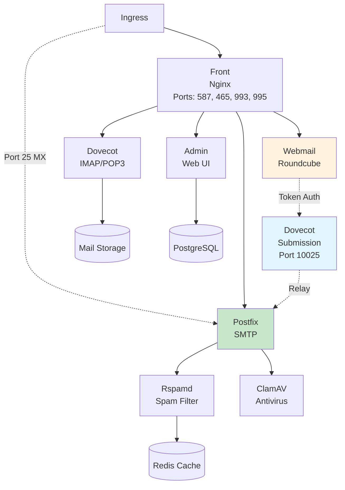

# Architecture Overview

**Understanding the design and structure of cdk8s-mailu deployments.**

## Introduction

cdk8s-mailu is designed around the principle of **composable constructs** - small, reusable building blocks that can be combined to create complex deployments. This architecture provides flexibility while maintaining production-grade defaults.

## Component Architecture

Mailu is a modular mail server composed of multiple services working together:



### Core Components

**Front (Nginx)**
- TLS termination (or Traefik passthrough)
- Protocol routing for authenticated mail protocols (SMTP submission 587/465, IMAP 993, POP3 995, HTTP/S)
- Authentication proxy for mail protocols (auth_http to Admin service)
- Load balancing to backend services
- **Note**: Port 25 (MX mail reception) bypasses Front and routes directly to Postfix for improved performance and reliability
- Always required for authenticated protocols

**Admin**
- Web-based administration interface
- User and domain management
- Configuration interface
- Always enabled by default

**Postfix**
- SMTP server for sending/receiving mail
- Mail routing and relay
- Spam/virus scanning integration
- **Port 25 (MX)**: Receives direct routing from Traefik (bypasses Front/nginx)
  - Traefik InFlightConn middleware: Limits simultaneous connections per IP (15 default)
  - Postfix anvil rate limiting: Limits connections/min (60), messages/min (100), recipients/min (300)
- **Port 10025**: Internal submission relay from Dovecot submission service
- Always required

**Dovecot**
- IMAP and POP3 server
- Mail storage and retrieval
- Authentication backend
- Always required

**Rspamd**
- Spam filtering
- DKIM signing/verification
- Header manipulation
- Always required

**Dovecot Submission Service**
- Dedicated service for webmail email sending
- Uses official `dovecot/dovecot:2.3-latest` image
- Listens on port 10025 for token authentication
- Relays to Postfix:25 using `submission_relay_host`
- Solves configuration issues with bundled dovecot in front container
- Always deployed (required for webmail functionality)

### Optional Components

**Webmail (Roundcube)**
- Browser-based email client
- Contact and calendar management
- Plugin system
- Enabled by default, can be disabled

**ClamAV**
- Antivirus scanning for attachments
- Virus definition updates
- Resource-intensive (requires ~1GB RAM)
- Disabled by default

**Webdav (Radicale)**
- CalDAV and CardDAV server
- Calendar and contact synchronization
- Disabled by default

**Fetchmail**
- Fetch email from external POP3/IMAP servers
- Consolidate multiple accounts
- Disabled by default

## CDK8S Design Patterns

### Construct Hierarchy

```
MailuChart (extends Chart)
  ├── Namespace
  ├── SharedConfigMap (service discovery)
  ├── NginxPatchConfigMap (TLS_FLAVOR=notls wrapper)
  ├── WebmailPatchConfigMap (backend connection patches)
  ├── FrontConstruct
  │   ├── Deployment (nginx with wrapper script)
  │   └── Service (HTTP, SMTP, IMAP, POP3 ports)
  ├── AdminConstruct
  │   ├── Deployment
  │   ├── Service
  │   └── PersistentVolumeClaim (5Gi)
  ├── PostfixConstruct
  │   ├── Deployment
  │   ├── Service (port 25, 10025)
  │   └── PersistentVolumeClaim (5Gi)
  ├── DovecotConstruct
  │   ├── Deployment
  │   ├── Service
  │   └── PersistentVolumeClaim (mailbox storage)
  ├── DovecotSubmissionConstruct
  │   ├── Deployment (AMD64 nodeSelector)
  │   ├── Service (port 10025)
  │   └── ConfigMap (dovecot.conf, entrypoint.sh)
  ├── RspamdConstruct
  │   ├── Deployment
  │   ├── Service
  │   └── PersistentVolumeClaim (5Gi)
  └── Optional:
      ├── WebmailConstruct
      ├── ClamavConstruct
      ├── FetchmailConstruct
      └── WebdavConstruct
```

Each construct is **self-contained** and manages:
- Kubernetes resources (Deployment, Service, ConfigMap, etc.)
- Resource requirements (CPU, memory)
- Volume mounts and storage
- Environment variables
- Service discovery configuration

### Configuration Flow

1. **User provides MailuConfig** - Type-safe configuration object
2. **MailuChart validates config** - Ensures required fields present
3. **Shared resources created** - Namespace, shared ConfigMap
4. **Constructs instantiated conditionally** - Based on component toggles
5. **Resources synthesized** - CDK8S generates Kubernetes YAML

### Resource Management Philosophy

**Defaults optimized for production:**
- Conservative resource requests (pods scheduled reliably)
- Higher limits (allow bursting for traffic spikes)
- Based on real-world usage patterns
- Can be overridden per-component

**Example:** Admin component
- Request: 100m CPU, 256Mi memory (guaranteed minimum)
- Limit: 300m CPU, 512Mi memory (burstable maximum)

## Storage Architecture

### Persistent Volumes

**Data Volume** (`/data`)
- Application data, SQLite database (if used)
- Configuration files
- Default: 10Gi

**Mail Volume** (`/mail`)
- User mailboxes and messages
- Largest storage requirement
- Default: 50Gi, adjust based on users

### Database Options

**SQLite (Default)**
- Simple, zero-configuration
- Suitable for small deployments (<100 users)
- Stored in `/data` volume

**PostgreSQL (Recommended for Production)**
- Better performance and reliability
- Required for high-availability setups
- Managed separately (CNPG, cloud database, etc.)

## Network Architecture

### Service Discovery

All components communicate via Kubernetes services:
- `{component-name}-service` - Standard naming pattern
- Internal DNS resolution
- No external dependencies for inter-component communication

### Ingress/TLS Options

**Option 1: Traefik TLS Termination (Recommended)**
- Traefik handles TLS for SMTP/IMAP protocols
- Nginx wrapper patches Front component
- Automatic certificate management

**Option 2: Front Direct TLS**
- Front handles TLS directly
- Manual certificate management required
- LoadBalancer or NodePort service

## Design Decisions

### Why CDK8S?

CDK8S was chosen over traditional YAML/Helm for cdk8s-mailu because it provides **infrastructure as code** benefits that are crucial for maintaining a complex, multi-component mail server deployment.

**Type Safety Prevents Configuration Errors**
- Catch mistakes at compile time, not deploy time
- IDE shows available options with autocomplete
- Impossible to reference non-existent fields
- Refactoring is safe and reliable

**Real Example**: When the dovecot submission service was added, TypeScript's type system immediately caught everywhere that needed updates (service discovery, ConfigMap, construct exports). With YAML, these would have been runtime failures.

**Programmatic Logic Simplifies Complex Configurations**
- Conditional resource creation based on config flags
- Dynamic service name generation with hashing
- Environment variable construction from multiple sources
- Resource calculation (e.g., convert "256Mi" to bytes)

**Testability Ensures Reliability**
- Unit tests for individual constructs
- Integration tests for complete deployments
- Test coverage >90% achieved
- Snapshot testing for manifest stability

Advantages:
- Type-safe configuration with compile-time validation
- IDE autocomplete and inline documentation
- Programmatic manifest generation with logic
- Testable infrastructure code (>90% coverage)
- Reusable constructs across projects

### Why Modular Constructs?

Each Mailu component is implemented as a separate construct class (AdminConstruct, PostfixConstruct, etc.) rather than one monolithic MailuChart. This modular approach was essential for managing complexity.

**Independent Testing and Development**
- Each construct has its own test file
- Can develop and test components in isolation
- Easier to debug when issues arise
- Regression testing catches component-specific breaks

**Flexible Configuration**
- Enable/disable components with simple flags
- Override resources per-component
- Customize storage per-service
- Different image tags per component possible

**Real Example**: The dovecot submission service was added as a new DovecotSubmissionConstruct without touching existing constructs. If it had been one big class, the change would have affected every test and increased risk.

**Clear Ownership and Documentation**
- Each construct file is self-documenting
- Props interface shows required configuration
- Construct methods are single-purpose
- Easy to understand data flow

Benefits:
- Component-level customization (resources, storage, images)
- Easier testing (unit test each construct independently)
- Clear separation of concerns (one construct = one service)
- Maintainability (changes isolated to specific constructs)
- Parallel development possible

### Why Production Defaults?

cdk8s-mailu is designed with **opinionated production-grade defaults** rather than minimal examples that require extensive configuration. This reduces the "time to working deployment" and prevents common misconfigurations.

**Resource Requests and Limits**
- All components have sensible CPU/memory defaults
- Requests ensure reliable scheduling
- Limits prevent resource exhaustion
- Based on real production metrics

**Example Defaults**:
- Admin: 100m CPU / 256Mi RAM (adequate for <1000 users)
- Postfix: 100m CPU / 512Mi RAM (handles typical mail volume)
- Dovecot: 200m CPU / 1Gi RAM (IMAP is memory-intensive)

**Storage Sizes**
- Admin PVC: 5Gi (configuration and SQLite if used)
- Postfix PVC: 5Gi (mail queue)
- Dovecot PVC: 50Gi default (adjust based on users)
- Rspamd PVC: 5Gi (spam filter data)

**Security and Reliability**
- Non-root filesystem disabled where needed (mail services require privileges)
- Health probes configured automatically
- Service discovery via environment variables
- PVC retention policies appropriate for mail data

**Real-World Validation**
- Defaults tested on production clusters
- Successfully deployed with AMD64/ARM64 mixed nodes
- Handles real email traffic and webmail usage
- Proven to work with Traefik TLS termination

Philosophy:
- "Works out of the box" for most use cases (minimal configuration required)
- Override only what you need (but you can customize everything)
- Based on real-world production deployments
- Fail-safe rather than fail-fast (conservative resources, not minimal)

## See Also

- [Dovecot Submission Service](dovecot-submission.md) - Detailed explanation of webmail email sending
- [CDK8S Patterns](cdk8s-patterns.md) - Construct design patterns
- [Configuration Options](../reference/configuration-options.md) - Complete API reference
- [Quick Start Tutorial](../tutorials/01-quick-start.md) - Deploy your first instance
